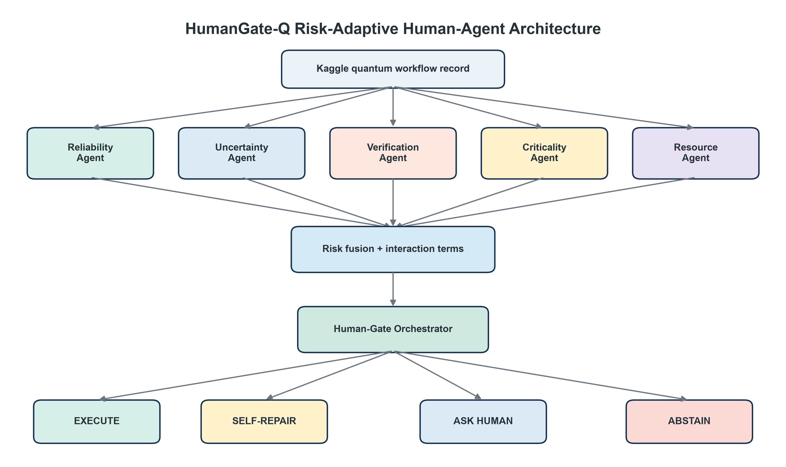
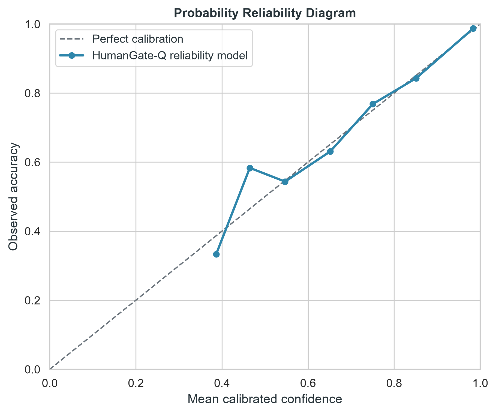
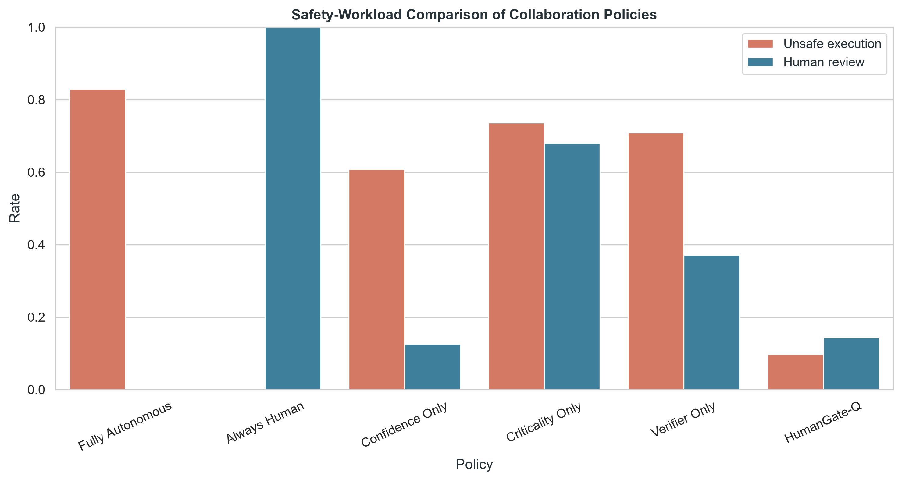
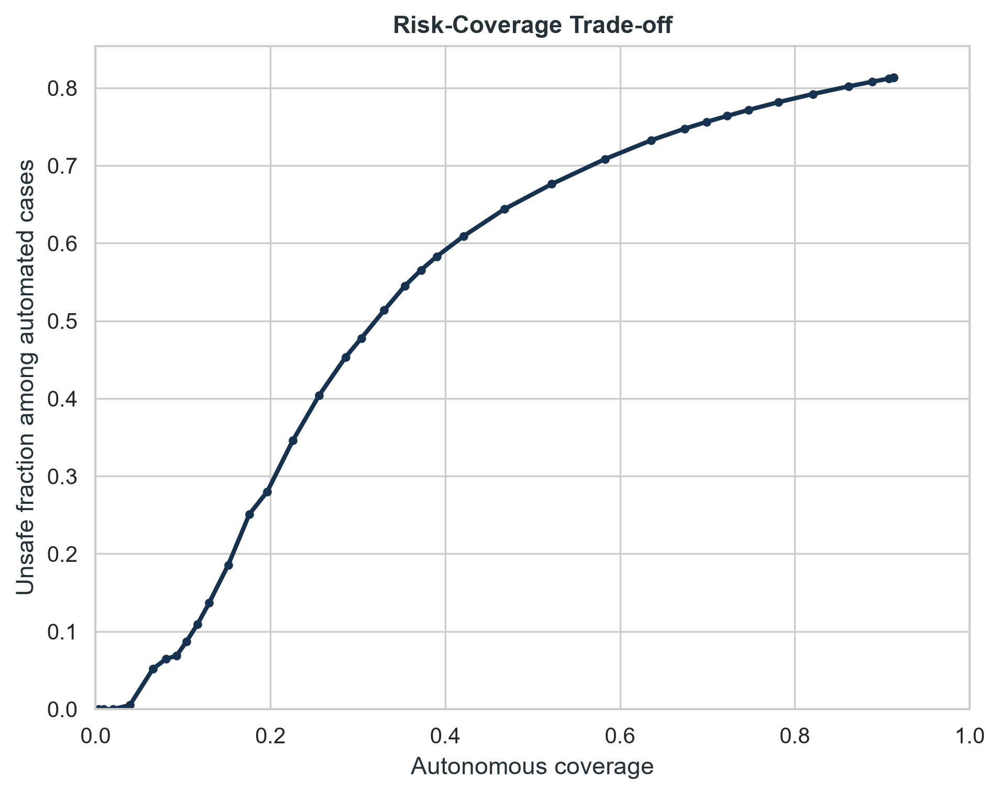
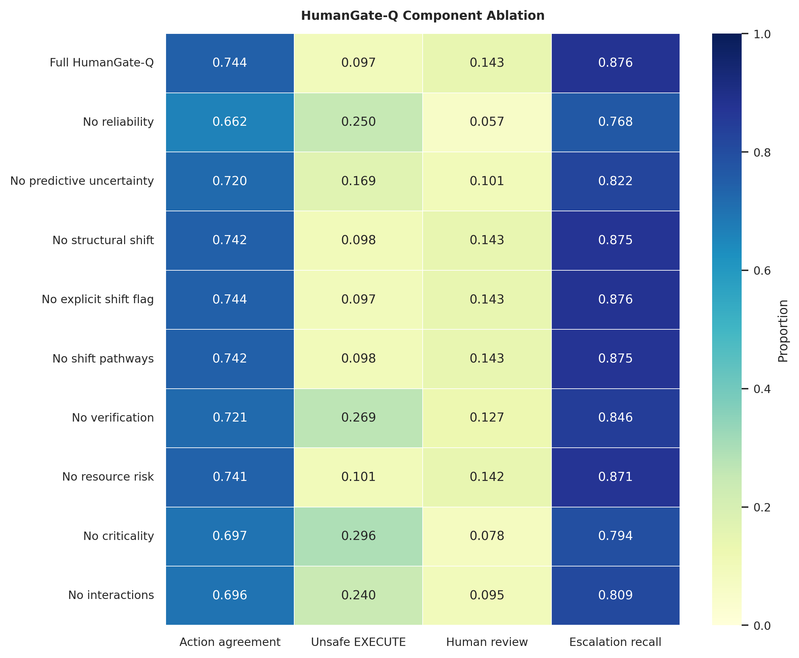

# HumanGate-Q

### A Risk-Adaptive Governance Framework for Bounded Autonomy in Quantum Agents

[](https://www.python.org/)
[](LICENSE)
[](https://www.kaggle.com/datasets/ykmadhav/synthetic-quantum-circuit-reliability-dataset)
[](REPRODUCIBILITY.md)

HumanGate-Q is the complete implementation and reproducibility package for the
book chapter **“HumanGate-Q: A Risk-Adaptive Governance Framework for Bounded
Autonomy in Quantum Agents.”** It converts calibrated quantum-circuit
reliability and contextual risk evidence into one of four governed actions:
`EXECUTE`, `SELF_REPAIR`, `ASK_HUMAN`, or `ABSTAIN`.

The repository contains the end-to-end source code, declared configuration,
automated tests, trained model, per-workflow audit trail, figures, tables, and
metadata for the run reported in the chapter. The Kaggle dataset is not
redistributed.

> **Scope.** This is an implementation study using synthetic circuits,
> simulated-noise labels, controlled workflow scenarios, and a declared
> reference policy. It evaluates bounded autonomy reproducibly; it does not
> certify real-world or real-QPU safety.

## System at a glance



Five evidence channels feed a transparent risk-fusion layer:

| Channel | Evidence used | Governance role |
|---|---|---|
| Reliability | Calibrated `HIGH`/`MEDIUM`/`LOW` probabilities | Estimates pre-execution circuit risk |
| Uncertainty | Predictive entropy and structural shift | Detects ambiguity and out-of-distribution inputs |
| Verification | Missing metadata, ambiguous goals, tool failure, explicit shift flag | Blocks or escalates unverifiable workflows |
| Criticality | Controlled application-consequence score | Tightens oversight for high-stakes contexts |
| Resources | Depth, operations, entanglement, CX depth, qubits | Represents execution complexity and demand |

The gate applies the four actions in a fixed precedence order, with tool
failure and unacceptable risk forcing `ABSTAIN`.

## Chapter-matched results

The audited run used 30,000 QUASAR circuits, 28 leakage-safe features, and
5,000 controlled held-out workflows. Exact artifacts are in
[`results/paper_run`](results/paper_run/).

| Result | Reported value |
|---|---:|
| LightGBM test accuracy | **89.55%** |
| Macro-F1 | **87.54%** |
| Expected calibration error | **0.74%** |
| HumanGate-Q reference-policy agreement | **74.40%** |
| Escalation recall | **87.63%** |
| Safe automation coverage | **90.04%** |
| Unsafe rate among `EXECUTE` decisions | **9.69%** |
| Human-review rate | **14.34%** |

These values can be checked directly in
[`model_metrics.csv`](results/paper_run/tables/model_metrics.csv),
[`policy_metrics.csv`](results/paper_run/tables/policy_metrics.csv), and the
per-case [`workflow_decisions.csv`](results/paper_run/tables/workflow_decisions.csv).

### Evidence gallery

| Calibrated reliability | Safety–workload comparison |
|---|---|
|  |  |
| **Risk–coverage trade-off** | **Expanded component ablation** |
|  |  |

The separate losslessly compressed, 600-dpi TIFF masters are documented in
[`PUBLICATION_FIGURES.md`](results/paper_run/PUBLICATION_FIGURES.md).

## Reproduce the experiment

### Windows: one-click route

1. Download or clone this repository.
2. Open the `HumanGate-Q` folder.
3. Double-click [`START_HERE.bat`](START_HERE.bat).

The script creates an isolated environment, installs dependencies, downloads
the Kaggle dataset, verifies the package, and runs the complete experiment.

### macOS or Linux

```bash
git clone https://github.com/Mind-Twister-Wizard/HumanGate-Q.git
cd HumanGate-Q
python -m venv .venv
source .venv/bin/activate
python -m pip install --upgrade pip
python -m pip install -r requirements.txt
python download_dataset.py
python verify_package.py
python run_all.py
```

A fresh full run is written to `outputs/latest/`. For a short environment
check, use:

```bash
python run_all.py --quick --download-if-missing
```

After a full run, compare it automatically with the chapter archive:

```bash
python compare_to_paper_run.py
```

No GPU, paid API, language-model key, or QPU account is required. The original
chapter run completed in 20.84 seconds on its recorded environment; runtime on
another computer will vary.

## Experimental safeguards

- **Leakage control:** identifiers, reliability targets, fidelity estimates,
  distance measures, and ideal/noisy success probabilities are excluded before
  training.
- **Partition separation:** 19,200 training, 2,400 calibration, 2,400
  policy-validation, and 6,000 reporting-only test rows.
- **Model selection:** six LightGBM candidates are compared only by
  three-fold cross-validation within training data.
- **Calibration:** scalar temperature scaling is fitted only on the calibration
  partition.
- **Policy selection:** 540 ordered threshold combinations are evaluated only
  on policy-validation workflows under declared safety/workload constraints.
- **Auditability:** the final configuration, dataset hash, environment, model,
  decisions, baselines, bootstrap intervals, and ablations are retained.

See [`REPRODUCIBILITY.md`](REPRODUCIBILITY.md) and
[`docs/METHODOLOGY.md`](docs/METHODOLOGY.md) for the full protocol.
The independent clean-rerun comparison is recorded in
[`results/paper_run/VERIFICATION_REPORT.md`](results/paper_run/VERIFICATION_REPORT.md).

## Repository map

```text
HumanGate-Q/
├── src/humangateq/          # Model, agents, policies, metrics, and figures
├── tests/                   # Dataset, modeling, policy, and ablation tests
├── docs/                    # Method, data, model, results, and chapter guidance
├── results/paper_run/       # Immutable artifacts reported in the chapter
├── data/raw/                # Local Kaggle download (ignored by Git)
├── outputs/                 # Fresh local runs (ignored by Git)
├── config.yaml              # Complete paper-run configuration
├── download_dataset.py      # Kaggle-only downloader
├── run_all.py               # End-to-end entry point
└── verify_package.py        # Dependencies, tests, schema, and hash checks
```

## Dataset

Only the Kaggle **Synthetic Quantum Circuit Reliability Dataset (QUASAR)** is
used:

- Page: <https://www.kaggle.com/datasets/ykmadhav/synthetic-quantum-circuit-reliability-dataset>
- Slug: `ykmadhav/synthetic-quantum-circuit-reliability-dataset`
- Archived-run source SHA-256:
  `506eff548af0603f771290cb75d3515f203d976162f3171b6494a1bb4d94025c`

Read [`docs/DATASET_CARD.md`](docs/DATASET_CARD.md) before reusing the data or
interpreting the results.

## Citation

GitHub will generate citation formats from [`CITATION.cff`](CITATION.cff).
Until the chapter receives its final bibliographic details, cite the software
as:

> Raj, A., and Rana, A. (2026). *HumanGate-Q: A Risk-Adaptive Governance
> Framework for Bounded Autonomy in Quantum Agents* (Version 2.1.0) [Computer
> software]. https://github.com/Mind-Twister-Wizard/HumanGate-Q

## Authors and license

Alok Raj and Anurag Rana, Yogananda School of AI, Computers and Data Sciences,
Shoolini University of Biotechnology and Management Sciences, India. ORCID and
affiliation details are in [`AUTHORS.md`](AUTHORS.md).

The software is released under the [MIT License](LICENSE). The Kaggle dataset
retains its own license and terms.
